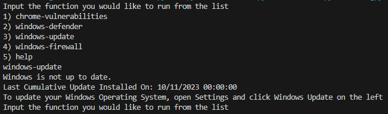
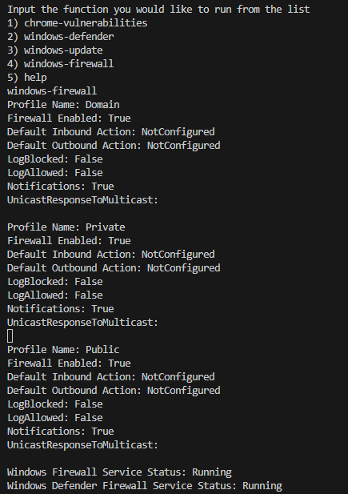

# IS565-project
This repo is a project for IS 565 Digital Forensics and Incident Response. Our code can be run on any python capable machine and checks if your machine is following best security practices.

Group Members: Erik Berges, Jo Windley, Jake Hadley

## Documentation V - 1.0 (September)

### How it works
- First the code checks if the file path where Google Chrome is installed exists
- Then a command is run that will determine what version of chrome is running
- If you version of chrome is 117 it will let you know if your application is up to date
- If your version of chrome is 115-116 you will be alerted that your application is out of date and instructions will be provided on how to update chrome
- If your version of chrome is 112-114 you will be alerted that your application is out of date, instructions will be provided on how to update chrome, and a list of your current vulnerabilites will be provided

### Proof of Value
The provided image includes the results of the scan being run locally on a machine. The results inform the user of the version of Chrome they are currently using and provides a link that allows them to update to the newest version.

Further down in the results it provides a list of known vulnerabilities with that version of Chrome. It gives details about each of the vulnerabilities to help inform the user of the risks they are facing by continuing to run that version of Chrome.

## Documentation Version 1.1 - New Features (October)

### How It Works

- The new features include a menu at the beginning when using the tool so users can choose a function or ask for help.
    - chrome-vulnerabilities
    - windows-defender
    - help
    
- After giving an input to the menu the tool will run the desired function.

- This will give an output that displays how to use the menu (help), your chrome vulnerabilities (chrome-vulnerabilities), or your antivirus status (windows-defender).

- The windows-defender function has been implemented as of this version and it will display if your built-in antivirus is working and if has detected any malicious activity.

### Proof of Value

The following images with their descriptions are the new features and updates in action using the security check python script.

Here is the menu and an example of the new 'help' function:

Here is the menu and an example of the new windows-defender function:

and the rest of the output for the windows-defender function:

The new function will tell you if your built-in antivrus is working and if has detected any malicious activity. The various parameters can give you more detail into the status of your windows-defender application that a window in the settings application may not tell you. This function can be used to detect any irregular behavior with your machine or its antivirus.

## Documentation Version 1.2 - New Features (November)
### How it works
- A function has been implemented that will run a powershell script. The powershell script runs various checks to see if your windows operating system is up to date. (windows-update.ps1)

- An additional function has been implemented that will run another powershell script. This powershell script gathers information on your windows firewall and prints the status to the console. (windows-firewall.ps1)

### Proof of Value
Here is a screenshot of the results returned from windows-update.ps1

Here is a screenshot of the results returned from windows-firewall.ps1
