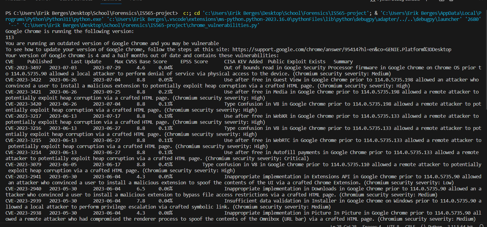

# IS565-project
This repo is a project for IS 565 Digital Forensics and Incident Response. Our code can be run on any python capable machine and checks if your machine is following best security practices.

## Documentation

### How it works
* First the code checks if the file path where Google Chrome is installed exists
* Then a command is run that will determine what version of chrome is running
* If you version of chrome is 117 it will let you know if your application is up to date
* If your version of chrome is 115-116 you will be alerted that your application is out of date and instructions will be provided on how to update chrome
* If your version of chrome is 112-114 you will be alerted that your application is out of date, instructions will be provided on how to update chrome, and a list of your current vulnerabilites will be provided

## Proof of Value

The provided image includes the results of the scan being run locally on a machine. The results inform the user of the version of Chrome they are currently using and provides a link that allows them to update to the newest version. 

Further down in the results it provides a list of known vulnerabilities with that version of Chrome. It gives details about each of the vulnerabilities to help inform the user of the risks they are facing by continuing to run that version of Chrome.